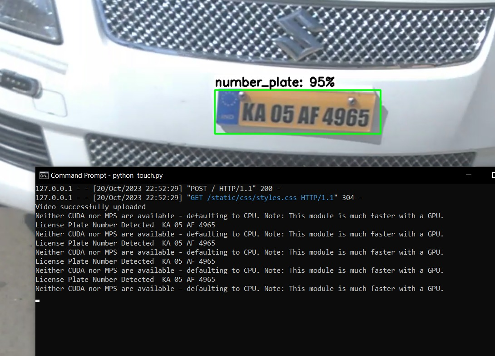

# Tensorflow Object Detection ML model

## Overview
This application is a solution designed for companies to streamline their parking facilities. This innovative system efficiently detects the license plate number from moving vehicles and saves the detected plate number through optical character recognition in a CSV file along with the timestamp at which the moving vehicle is detected. It can be used to manage vehicle entry and exit and track the vehicles entering their company premises.
 
 

## Tech stack used:-
#### TensorFlow | Pytorch | OpenCV | Python | Flask | EasyOCR(Optical Character Recognition) | CSV File 
